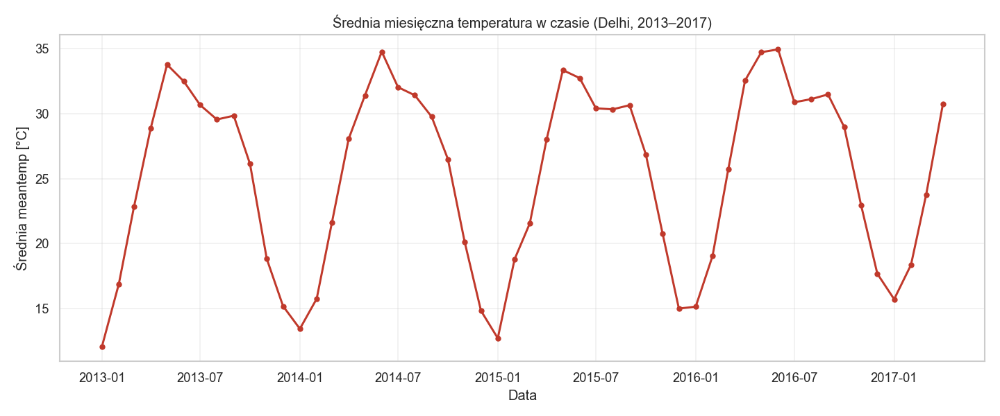

# Delhi daily climate: cleaning, aggregation and seasonality analysis

A pandas data-analysis project on historical weather data for Delhi (2013–2017):
- data-quality checks
- outlier correction
- time-based feature engineering
- group-by and pivot-table aggregation
- seasonality plots

MSc student project, Gdańsk University of Technology, 2026. Course: *Python Language*.



## Highlights

- Merged the Kaggle *train* and *test* files into one continuous series: **2013-01-01 → 2017-04-24, 1 575 days**.
- Found and fixed **8 unrealistic `meanpressure` values** (e.g. 59 hPa, negative values, values in the thousands). They were set to NaN and filled by time interpolation.
- Validation with `assert`s, e.g. humidity must stay within 0–100 %.
- Engineered `year`, `month` and `season` columns, plus a pivot table of mean temperature by year × month.
- Heat-wave filter: **90 days with mean temperature > 35 °C**, mostly in May–June, with a peak of ≈ 38.7 °C.

## Structure

```
data/        DailyDelhiClimateTrain.csv, DailyDelhiClimateTest.csv
notebooks/   projekt_pogoda.ipynb (main notebook, sections 1–7 with outputs)
outputs/     figures
scripts/     build_notebook.py (regenerates the notebook from code)
```

## How to run

```bash
pip install -r requirements.txt
python scripts/build_notebook.py          # optional: regenerate the notebook
cd notebooks && jupyter nbconvert --to notebook --execute --inplace projekt_pogoda.ipynb
```

**Data source:** [Daily Climate Time Series Data](https://www.kaggle.com/datasets/sumanthvrao/daily-climate-time-series-data) (Kaggle).

## AI assistance

The code in this repository was written with the help of AI tools (large language models). Defining the tasks, running the analyses, and checking and interpreting the results were my part of the work.

---

## 🇵🇱 Opis po polsku

Projekt zaliczeniowy z Pythona (temat 11): analiza historycznych danych pogodowych Delhi.

- Wczytanie i połączenie plików z Kaggle.
- Kontrola jakości: korekta 8 błędnych wartości ciśnienia, interpolacja, asserty.
- Kolumny pochodne (rok, miesiąc, pora roku).
- `groupby` i `pivot_table` (rok × miesiąc).
- Wykrycie fal upałów i wykresy sezonowości.

Notebook z wynikami: `notebooks/projekt_pogoda.ipynb`.

Projekt studencki (studia II stopnia), Politechnika Gdańska, 2026.

**Wsparcie AI:** kod w tym repozytorium powstał z pomocą narzędzi AI (dużych modeli językowych). Określenie zadań, uruchamianie analiz oraz sprawdzenie i interpretacja wyników były moją częścią pracy.
